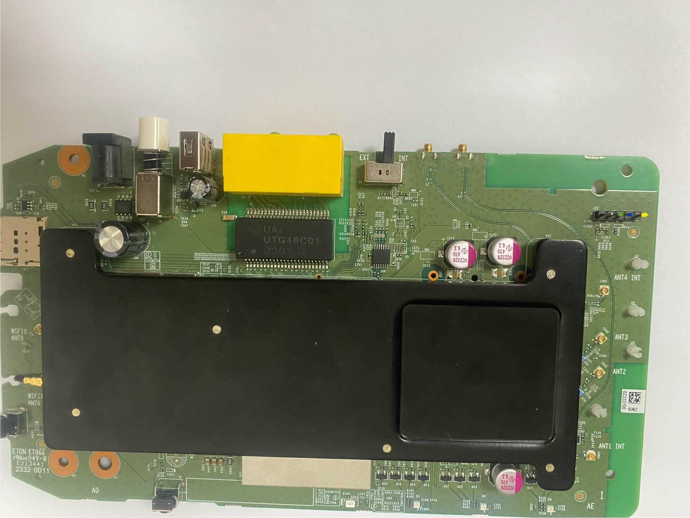

# Zyxel MT6890 CPE — recovery firmware & tools (NR5103 / NR5103Ev2 / FWA505)

Unbricking / recovery images and a recovery binary for MediaTek **MT6890**-based Zyxel
5G CPEs. This repo exists for **one** reason: to help owners restore devices whose
**NAND or eMMC was erased** — usually by someone who ran a flashing tool blindly,
with no backup, and turned a working router into a paperweight.

If that's you (or the clueless person who did it to your device): the images here can
bring it back. Read everything below first.

---

## ⚠️ FLASH AT YOUR OWN RISK — read this or walk away

- Flashing firmware can **permanently and irrecoverably brick** your device. There is
  **NO warranty, NO support, and NO guarantee** of any kind.
- **You alone** are responsible for what you flash and what happens. If you do not fully
  understand the steps in the release notes, **STOP NOW.**
- **Identify your EXACT device and storage type before flashing.** These devices share a
  SoC but split into **NAND** (NR5103Ev2, FWA505) and **eMMC** (NR5103 non‑E). Flashing a
  NAND image/scatter onto an eMMC board, or vice‑versa, **WILL BRICK IT.**
- A failed **preloader** write during SP Flash Tool is the one mistake there is usually no
  coming back from. Keep USB power and the cable rock‑solid.
- **SP Flash Tool gotcha:** install the **MediaTek USB VCOM / preloader drivers first**, use a
  **USB Type‑A‑to‑Type‑A** cable, and **arm "Download" with the device powered OFF, then power
  it on** — the bootloader's USB‑download window is tiny, so the tool must already be waiting.
  Full steps in the release notes.
- **Already flashed the wrong variant?** A common mix‑up is flashing the publicly‑available
  **non‑E** firmware onto an **NR5103E / FWA505**. It's almost always recoverable: if the WebUI
  still loads, just reflash the correct device's **stock WebUI** image; otherwise use SP Flash
  Tool. See "wrong variant flashed" in the release notes.

`stock` = unmodified factory firmware (your clean recovery baseline).
`rooted` = the same firmware with a root shell + recovery tooling bolted on — for recovery
and lab use **only**. Read the next section before you even think about leaving one running.

---

## ☣️ The `rooted` images ship a WIDE‑OPEN ROOT BACKDOOR — on purpose

Every `-rooted` image **deliberately** contains:

- an **unauthenticated, passwordless root `telnet` server on TCP port 23**, started on
  **every boot**, dropping straight into a root shell with **no password at all**; and
- an SSH server (dropbear) with a **known, published default root password**.

This means **anyone who can reach the device on the network gets instant, complete root.**
That is not a bug — it is a deliberate recovery affordance so you can get into a half‑dead
unit. It also makes the device **catastrophically insecure**.

**NON‑NEGOTIABLE RULES for rooted images:**
- **NEVER** connect a rooted unit to the internet or any WAN.
- **NEVER** run one on a production, home, or otherwise untrusted network.
- Use it **only** on an isolated lab LAN, recover what you need, then **immediately** flash
  the matching `-stock` image (or at minimum disable telnet and change the root password).
- If you leave a rooted image running on a real network, that is **entirely on you.**

---

## 🛠 Recovery binary

`mrd-recover` — a static, zero‑dependency aarch64 binary (also baked into every `-rooted`
image) that repairs an **erased / blank MRD** (the per‑unit identity block: serial, MAC, and
the encrypted admin/Wi‑Fi/supervisor passwords) on `/xnvfile/.xmrd`, then forces the config
to re‑read it. Use it after an erase to put the unit's identity and a known admin password
back. Usage is in the release notes.

---

## 🔌 UART serial console

For watching boot, recovery, and getting a root shell, the board has a 1.8 V TTL UART header,
silkscreened **`J28`**: ( *DON'T USE 3.3 TTL UART ADAPTERS* ) 

| pin 1 | pin 2 | pin 3 | pin 4 |
|---|---|---|---|
| **VCC** | **TX** | **RX** | **GND** |

- Settings: **921600 baud, 8N1** (8 data bits, no parity, 1 stop bit), no flow control
- Use a **3.3 V** USB‑TTL adapter. **Do not connect VCC** — it is not needed and back‑feeding
  power can cause problems; wire only **GND, TX, RX** (adapter TX→board RX, adapter RX→board TX),
  with the device on its own power supply.
- **TX/RX may be mislabelled/reversed** in the silkscreen vs the photo (the photo's orientation
  is unconfirmed). This is **not fatal** — if you get no output or garbage, **swap TX and RX**
  and retry. Wrong baud shows as garbage; correct baud + swapped data lines shows as silence.

---

## ⚖️ Legal / copyright — no infringement intended

The stock firmware mirrored here is the property of **Zyxel Communications** (and MediaTek
for the SoC blobs); **all trademarks belong to their respective owners**. Nothing here is
original Zyxel/MediaTek IP that this project claims to own, and **nothing is sold**.

- The **NR5103 (non‑E)** and **FWA505** stock firmware are **publicly downloadable from
  Zyxel's own support site** — they are mirrored here purely so a bricked owner has a
  known‑good baseline in one place.
- The other stock image is **very hard to obtain anywhere**, which is precisely why it is
  provided — to give legitimate owners of an erased unit *any* path back. It is offered
  **solely** for that recovery purpose.

These files exist to help people fix **their own hardware**. If you are a rights‑holder and
want anything taken down, open an issue and it will be removed. Use of everything here is at
your own risk and your own legal responsibility.

---

## 🔗 References & sources

Where the publicly‑available stock firmware comes from, and the community research this
builds on:

- **Zyxel — Nebula FWA505 official downloads** (the public FWA505 firmware):
  <https://www.zyxel.com/global/en/support/download?model=nebula-fwa505>
- **Zyxel — NR Series (NR5103 non‑E) firmware & resources** (the public NR5103 non‑E firmware):
  <https://support.zyxel.eu/hc/en-us/articles/4403365084818-Zyxel-5G-Devices-NR-Series-Advanced-Downloads-Firmware-and-other-resources#h_01J7ZRPW1H5MESQEY35B2SANCS>
- **ispreview forum — "Three Zyxel NR5103Ev2 → Zyxel Nebula FWA505 firmware (Global Edition)
  upgrade"** (background on running the global FWA505 firmware on an NR5103Ev2, and the Zyxel
  download page above):
  <https://www.ispreview.co.uk/talk/threads/three-zyxel-nr5103ev2-to-zyxel-nebula-fwa505-firmware-global-edition-upgrade.43598/>
- **ispreview forum — "New Three 5G Hub NR5103E"** (secFOTA / firmware‑update discussion):
  <https://www.ispreview.co.uk/talk/threads/new-three-5g-hub-nr5103e.38663/post-345967>
- **OpenWrt forum — "Zyxel NR5103 observations"** (community reverse‑engineering of the
  NR5103 non‑E):
  <https://forum.openwrt.org/t/zyxel-nr5103-observations/207842>
- **OpenWrt forum — "I hope you guys can help me — 5GEE (2021) Zyxel NR5103"** (community help
  thread on the 5GEE/NR5103):
  <https://forum.openwrt.org/t/i-hope-you-guys-can-help-me-5gee-2021-zyxel-nr5103/175556>

---

## 📥 Downloads

See **[Releases](../../releases)**. Each device has `stock` + `rooted`, in two flashing
flavors (WebUI and SP Flash Tool). The release notes tell you exactly which file matches
your device and how to flash it.

---

## 🙏 Credits

Huge thanks to **Saeed** — for fearlessly testing every image on real hardware, for throwing
**two of his own NR5103Ev2 units in as guinea pigs**, and for slogging through all of it across
a language barrier without flinching. None of this would be confirmed‑working without him. 🫡

---

*Reverse‑engineered, built, and documented — co‑created with **Claude** (Anthropic). ❤️*
